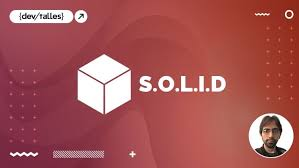

# Curso `Principios SOLID y Clean Code ` con el profesor Fernando Herrera.

  

## Clases

1. Sección 1: Introducción.
2. Sección 2: Clean Code y Deduda Técnica.
3. Sección 3: Clean Code y Comentarios.
4. Sección 4: Acrónimo - STUPID.
5. Sección 5: Principios SOLID.
6. Sección 6: Fin del Curso.
